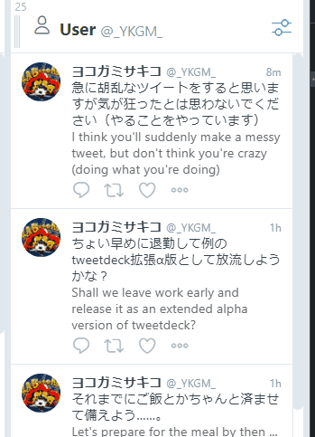

# Tweetdeck auto-translator for Google Chrome
author: <a href="https://twitter.com/_YKGM_">`@_YKGM_`</a>

It's α version and operation is not guaranteed. Bugs reports are welcome :)

# Installation
This Chrome extension is an unpackaged and must be installed using developer mode.

- Download the contents of this repository
- Enter `chrome://extensions/` in the address bar
- Turn on the **developer mode** toggle in the upper right
- Click the **Load unpacked** button in the upper left
- Select the downloaded one

# Usage
Right-click on the extension icon and select "option" to open the settings window. Set the languages to be translated and the language to translate to. Tweetdeck needs to be reloaded after changing the extension settings.

**Provisional Action: Read the Issues section and set up the GAS API endpoint**

Then...

Enjoy!

# Issues
## LanguageApp (GAS) Limit Rates
The API endpoint using the LanguageApp class of GAS probably has a limit rate of 10,000 times per day. Therefore, it is difficult to share one endpoint with users of this extension.

So...

### How to create a translation API endpoint with GAS
1. Access the GAS dashboard `https://script.google.com/home`
2. Create **New project**
3. Copy and paste the content of `gas/api.js` from this repository
4. Click the save button 💾 above the editor
5. Click the **Deploy** button and select **New Deployment**
    - choose **Web app** for type, **Me** *(your e-mail address)* for "Execute as", and **Anyone** for "Who has access"
    - then click "Deploy".
6. Copy the displayed **Web app URL**, paste it into the API endpoint field of settings window.

That's all. It will work up to 10,000 translations per day.
